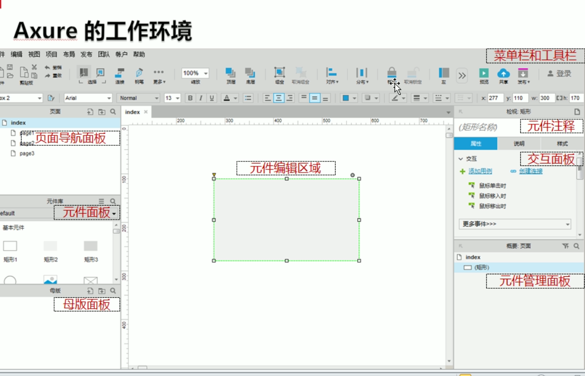
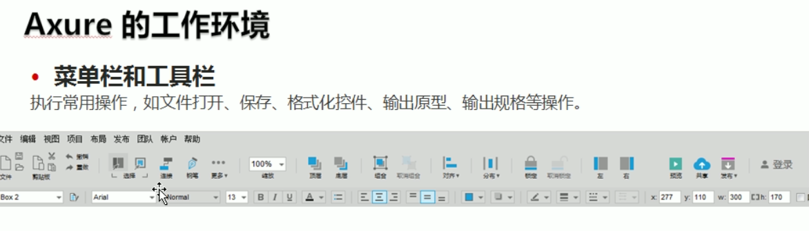
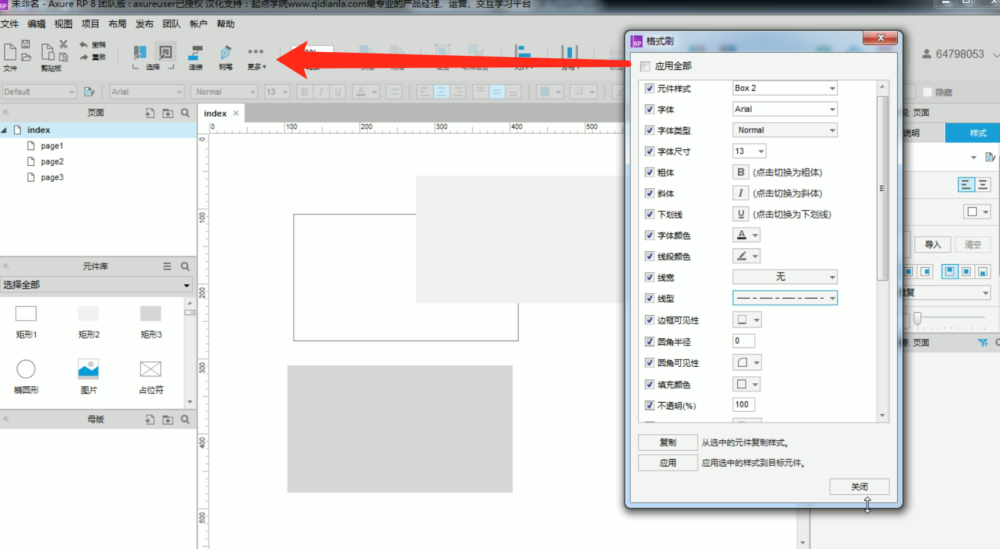
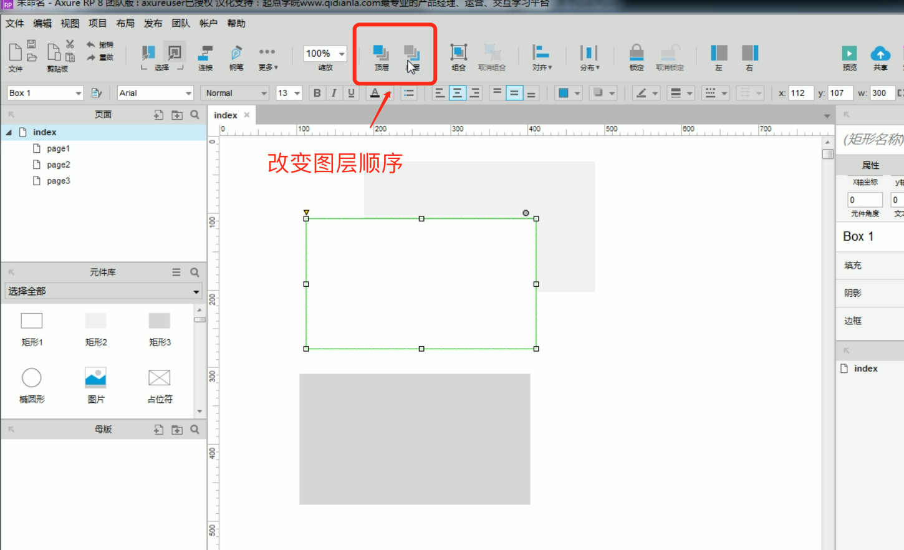
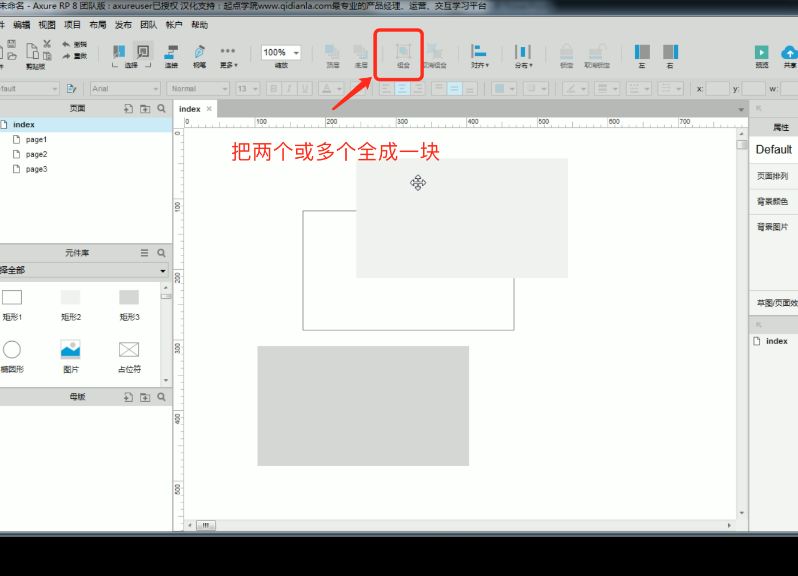
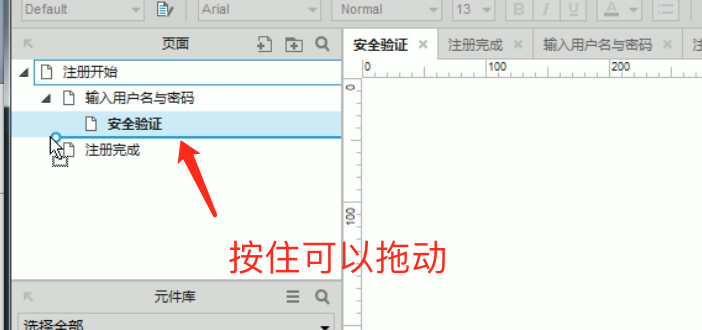
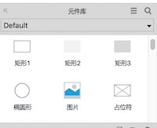

#### 为什么要进行原型设计

* 缺乏使用者的参与
* 需求或规格不完事
* 需求或规格变更

#### 原型分类
* 低保真型（手绘型）
* 中保真型（使用相关软件绘制出来的）
* 高保真型（包含效果图及原型交互）


#### 菜单栏和工具栏






#### 页面或元件库
* 新建页面.  修改层级关系：
* 元件库. 


````
   F5 在浏览器中预览
````

#### 软件的基本操作

* 元件的使用：在RP(axure)中使用元件，需要选择后拖拽到工作区中即可；
* 矩形的使用：矩形代表了所有的几何图形（通调整左上角的三角形或右上角的圆形）

````
   注意：直接拖拽左上角更改圆角，点击右上角的黑色圆理性成其他的图形；
````
* 旋转的使用：绘制好元件后，选择它，按住ctrl（commond）键，直接挺拽定界框周围即可；
* 图片元件的使用：

````
   如何导入图片？直接双击当前的图片元件即可；也可以在选择元件后，在右侧的属性导入即可；
   知识扩展：axure可以完美支持gif图片，但是需要在导入后不要进行优化（否则原来的gif效果将丢失）
           工作时在网上找的素材可以直接截图并粘贴互AX中进行使用；
````

* 占位符：直接拖进去，可以双击输入文字
* 文字元件：
* 直线元件（水平或垂直）
* 画笔生硬度及大小技巧扩展
````
  方法一：
     生硬：shift+右括号键   模糊：shift+左括号键   大小：左右括号
  方法二：
     按住alt键不放，单击鼠标右键，大小左右移动  生硬度：上下拖动鼠标
     
````
* 切图技法三（快速）：首先需要将切图的图层或组转换为智能对象，将其他不需要切图暂删除不要保存， 在文件菜单中找到导出-》选择将图层导出到文件（注意选择需要的格式），这时ps将自动帮你完成切图；
